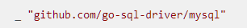

# GO

- **Number System**
    
    **Hexadecimal** base 16 binary number. Denoted by 0-9 and A-F
    
    
    
    verbs %x and %X to print it as a Hexadecimal
    
    n2 := 0x9F4 // this will represent hexadecimal in codes
    
    **Octal** represent base 8 binary number. denoted by 0-7
    
    
    
    verbs %o to print it as an Octal
    
- **Go Module**
    
    **On Creating Module :**
    
    - Group by similar functionalities. e.g. handler for DB queries, logging module.
    - Tightly coupled i.e. different parts of a module are strongly linked with each other
    - Loose coupling i.e. independency of a module, they should not depend on other.
    
    **Blank Import** i.e. “_” will automatically called init() on their corresponding package. 
    
    e.g. :
    
    
    
    **Internal directory** : packages that under it can only be used by it’s own module it means others module cannot use it.
    
    **Initialization Rules :**
    
    The Imported package initialized
    
    - Variables are initialized
    - init() function are run
    - The Package itself initialized
        - Variables are initialized
        - init() function are run
    
    Note that the rules are run sequentially i.e. in order. Package also can have multiple numbers of init() function.
    
    **Go Module** : set of packages with go.mod & go.sum.
    
    **require section** : set of dependency of current module.
    
    **exclude section** : explicitly exclude a version for our build. 
    
    **replace section** : replace module dependency with another version. Note that replace also may refer to local directories. denoted by : replaced_version ⇒ replacement_version
    
    **indirect dependencies** : occurs when we upgrade or remove module dependencies manually.
    
    go.sum : ensures the dependencies that we used are the same as it’s authors.
    
    **Semantic Versioning**
    
    let X be major version, Y be minor version, & Z be patch version i.e. bug fix. Where X, Y, Z are members of positive integer. And let X.Y.Z denotes the way version number are formed.
    
    Increment in X means that X expecting it wont be compatible with the version before of it.
    
    Increment in Y means that new feature does not breaking the current X.
    
    Increment in Z means patch of current features. e.g. bug fixes.
    
    The build list is the list of modules necessary to build a Go Program.
    
    Each item of this list is composed of two things
    
    - A module path identifies a module
    - A revision identifier (which can be a tag or a commit id)
    
    The steps required to create the build list for a given module are [5](https://www.practical-go-lessons.com/chap-17-go-modules#fn5) :
    
    1. Initialize an empty list L
    2. Take the list of modules required for the current module (go.mod)
    3. For each module required
        1. Get the list of modules required by this module (go.mod)
        2. append those elements to the list L
        3. repeat the operation for elements appended to the list
    4. In the end, the list may contain multiple entries for the same module path.
        1. If so, for each module path, keep the newest version.
    
    go mod init : command to initialize go module.
    
    go install : A Command that automatically adding or updating required dependencies to go.mod file and creates go.sum file.
    
    go mod tidy -v : A command to cleanup go,mod & go.sum files.
    
    go mod vendor : create a **vendor** folder with all the sources of your dependencies
    
    go mod verify : check locally stored dependencies.
    
- **Method**
    
    Method are a function that attached to type
    
    
    
    Receiver had 2 types namely value receiver & pointer receiver. Denoted by type T & type *T respectively. A method with pointer receiver allow the method to modify the values of it’s type.
    
    - Use a **Pointer Receiver** when :
        - Your struct is heavy (otherwise, Go will make a copy of it)
        - You want to modify the receiver (for instance, you want to change the name field of a struct variable)
        - Your struct contains a **synchronization primitive (like sync.Mutex)** field. If you use a value receiver, it will also copy the mutex, making it useless and leading to synchronization errors.
    - Use a **Value Receiver** when :
        - When your struct is small
        - When you do not intend to modify the receiver
        - When the receiver is a map, function, channel, slice, string, or interface value (because internally it’s already a pointer)
        - When your other receivers are pointers
- **Pointer**
    
    **Pointer** : is set of type that contains data that are stored in specific addresses in memory.
    
    
    
    with operator asterisk (*) we follow the address, with operator ampersand (&) we take the address.
    
    Note that asterisk operator both used to initialize pointer type and dereference, thus we must careful when examining it as the use of it depends on the context.
    
    **Maps & Channels are reference by default**, it means when we use it as a parameters in functions & methods we able to modify it even though it’s not pointer type.
    
    On the other hand when we have Slice as a parameters by default the function copy it. We actually still able to modify it but only limited to element that already exists.
    
- **Testing**
    
    **Unit Test** : A means to ensures that individual parts of the applications work i.e. exclusively checking functions or method. A single unit test is called a test case. A group of test cases is called a test set.
    
    **Test case includes** :
    
    - Test Input
    - Expected Output
    - Actual Output
    - Assert that our actual output corresponds with expected output. Usually using assertion package.
    
    **Why Unit Test ?**
    
    - Ensures that method or function works as expected. It follows we can reproduce such scenario once development phase of that particular function is done.
    - Prevent regression i.e. changes once applications is released.
    - Can serve as a code documentations.
    
    **The go test modes**
    
    - Local Directory : Will run all of the test in current directory that is all of the tests that in the same level of current directory.
    - Package List : go test modulePath/pkgName such that it will run all tests on that particular package.
    
    Use **t.Parallel()** in the start of each test function to enable that such test function will run parallel.
    
    **Coverage Flags (-cover)** : The coverage data give you a statistic about the percentage of statements of your code that is covered by a unit test
    
    go test -coverprofile profile
    
    
    
    
    
    **Test-Driven Development (TDD) :** Development method where you design the tests before actually writing the software.
    
- **Array & Slices**
    
    **Array** :
    
    - An array is a **collection** of elements of the same type.
    - The type of elements inside an array is called the Element Type
    - This collection has a **fixed number of elements known at compile time**.
    
    var x [5]int = [5]{1,2,3,4,5} or x := [...]int{1,2,3,4,5}
    
    Note that if we use array as a parameters in some methods or functions, it will create copies of an array thus it will modify the copies not the actual array itself. So if we want the array to be modified make sure to pass pointer instead. It follows when we copy the array it will create brand new separate array that have different locations in memory.
    
    **Slices**
    
    As opposed to fixed elements of array, slices is growable collection it means you can add more elements to it.
    
    **Slices literal** : can be used to initialize slice, automatically creates an array for that slice to refer it, it follows that the length and cap is the same at initialization.
    
    slice := []int{1,2,3}
    
    slice := make([]int, 10) (data type, the length / capacity)
    
    slice := make([]int, 10, 15) (data type, the length, capacity)
    
    **Slicing Operation** : slice[LOW:HIGH] it means we take elements of slice from index LOW to index High-1. Intuitively LOW inclusion & HIGH exclusion. LOW ≤ slice < HIGH.
    
    Note that when we use slicing operations we do not create copy but we reference instead. Thus when the actual array get modified the sliced elements will got modified too and vice versa. 
    
    Paradoxically when we slicing string we won’t be able to modify it since string is immutable in Go.
    
    The slice is the conjunction of three elements :
    
    1. A pointer to an underlying array. The pointer points to the underlying array where the slice begins. It points to the **first element of the slice**.
    2. The length of the slice (an **`uint`**)
    3. The capacity. (an **`uint`**) 
    
    
    
    **What happens when we pass slices as parameters and the slices exceed the original capacity?**
    
    - When the function is called, the runtime takes a reference of the slice.
    - A new underlying array is allocated inside the function because the capacity is exceeded.
    - The reference to the underlying array that the slice holds internally has been changed.
    - But, it has been changed only on the copy of the slice.
    - When the function returns, the copied slice is destroyed. The slice languages still reference the old underlying array.
    - Solutions: pass pointers of slices instead.
    
    Built-in **copy** functions :
    
    
    
    Note that the number of elements copied will be the minimum between the source’s length and the length of the destination.
    
    **append built-in function:**
    
    
    
    A function is said to be **variadic** when it has a **numbers variable of parameters**. 
    
    The function definition does not fix the number of parameters. In the signature of the function, you can detect this by looking for the three dots **"...**".
    
    
    
    **How the slices grow?**
    
    
    
    **How to remove element in slice?** e.g. remove at index 8
    
    
    
    **How to append element at specific index?**
    
    
    
- **Map**
    
    **Capabilities** :
    
    - store a value with a specific key
    - delete a value stored with a specific key
    - retrieve a value stored with a specific key
    
    **Pros** :
    
    - Faster lookup than lists
    - Arbitrary keys
    
    **Cons** :
    
    - Key collision i.e. distinct keys
    - Unordered sequence
    
    **Excluded Types :** 
    
    - function
    - map
    - slice
    - array of function, map, or slice
    - struct type that contains fields of type function, map, or slice
    
    **Literals :**
    
    - idMap := make(map[string]int)
    - idMap := map[string]int{”joe”:123}
    
    How map works in GO? It used hash tables.
    
    
    
    Note that garbage collector will not remove hash-map that still in memory, thus we might consider using delete(idMap, “joe”) where idMap denotes variable of hash-map & string “joe” are the key.
    
- **Anonymous Function**
    
    **Anonymous Function** : similar to traditional function except it does not includes the name.
    
    Note that we can store functions inside of variable, it might seems unintuitive because it is prevalent to use variables to store values.
    
    **Literals** :
    
    - To define the function, use the syntax : **`func**(){..}`
    - To define and run it : **`func**(){..}()`
    
    **Go functions are considered as first-class objects**. It means that :
    
    - Functions can be passed as arguments to other functions
    - You can return functions from other functions
    - You can bind functions to variables
    
    An **anonymous function** defined into another function `F` can use elements that are not defined in its scope but in the scope of `F`. Anonymous functions can keep references to its surrounding state. A **closure** is formed when a function references variables not defined in its own scope.
    
    
    
- **Enum**, **Iota, & Bitmask**
    
    An “**enum**” (or enumeration data type) is a **data type** that consists of a set of “values that are explicitly defined.
    
    **Iota :** constant iota used it when distinction of the constant is matters not the value itself
    
    
    
    **Byte** : is composed of 8 bits of memory. A bit is a binary digit. It’s either equal to 0 or 1.
    
    
    
    **Bitwise Operations**
    
    ****AND operator : `&`**
    
    
    
    ****OR operator : `|`**
    
    
    
    ****XOR Operator : `^`**
    
    Exclusive OR is equal to 1 only if one of the operand is 1, not both.
    
    ****NOT Operator : `^`**
    
    NOT Operator will invert the value of the bits.
    
    Note that the NOT & XOR had the same operator thus the use of it depend on the context.
    
    
    
    ****AND NOT operator : `&^`**
    
    Suppose we had x &^ y. The result would be we set value of x to 0 if y is 1. 
    
    It is equivalent to x & (NOT y).
    
    
    
    **Left Shift** ****`<<`****
    
    Let x & n be positive integer. Then x << n means we shift bits of x to n position to the left.
    
    Left shift represent product of x*2^n.
    
    
    
    **Right Shift** ****`>>`****
    
    Let x & n be positive integer. Then x << n means we shift bits of x to n position to the right.
    
    Right shift represent x divided by 2^n.
    
    
    
- ****Concurrency****
    
    **Parallelism** : ability to do multiple tasks at the same time. Difficulties: 
    
    - When to start or stop
    - What if such task need data from another task
    - tasks conflict when accessing memory
    
    **Concurrency**: the ability to enable parallelism. i.e. such task to be executed out of order or in partial order, without affecting the final outcome.
    
    **The Pitfalls :**
    
    - Data Race i.e. accessing shared resource at the same time.
    - Deadlock i.e. two threads waiting each other. In such case the program will be blocked as no progress can be made.
    
    **Goroutine** : A function that executes independently from the rest. **Launching a goroutine does not block the main thread.**
    
    ****Channels :**** A pipeline that enables goroutines to communicate with another.
    
    
    
    **Types of Channels** : For some type of T.
    
    - Send Only : **`chan<- T`**
    - Receive Only : **`<-chan T`**
    - Bidirectional : **`chan T`**
    
    As a rule of thumb if an arrow pointing towards the channel denotes **sending** data into channel. Otherwise receive.
    
    **Send Statements Rules :**
    
    - The channel and the expression are evaluated before communication
    - You can send on channel if it’s open. **Send on closed channel will cause Panic!**
    - If you send on a **nil-channel** it will blocks the program.
    
    **Closing Channels:** Indicates that no more values will be sent through said channel.
    
    - Cannot closed receive only channel
    - Cannot send data on closed channel
    - Cannot close channel that already closed
    - Can receive data on closed channel
    
    
    
    **Unbuffered Channel** :  Goroutine will **blocked until data is received by another goroutine**. The blocker is the sender. 
    
    e.g. synchronize two goroutines :
    
    
    
    **Buffered Channel** : Goroutine will **blocked until data is stored in the buffer**. Thus the sender only wait until the data is copied to the internal buffer. 
    
    Use for-range statements to receive all the data sends on channel.
    
    ****Wait groups****
    
    It used to wait groups of goroutines to finish their task.
    
    Note that launching goroutines does not block the main goroutine.
    
    To be remembered: 
    
    - Create a waitGroup :
    
    ```
    var waitGroup sync.WaitGroup
    ```
    
    - Increment the wait group counter :
    
    ```
    waitGroup.Add(1)
    ```
    
    - Decrement the wait group counter :
    
    ```
    waitGroup.Done()
    ```
    
    - Block the current goroutine until all goroutines have finished :
    
    ```
    waitGroup.Wait()
    ```
    
    
    
    ****Mutexes****
    
    We say two events are **mutually exclusive** if they cannot occur at the same time**.**
    
    e.g. “Bike turning to the left” & “Bike turning to the right”.
    
    It is common to see the sync.Mutex in a struct. Generally it placed on top of field variable that it need to protect.
    
    **Concurrent Program Design**
    
    - Identify the Task see if we can decompose it into several operations.
    - Identify the type of Input and Output
    - Order Dependency : what task should be ahead and behind another
    - Data Dependency : different operations that depend on the same piece of data.
        - e.g. read & decreasing stock
- **Context**
    
    It means to unite, link, connect, or associate something with group of other things.
    
    It is any information that we can use to characterize the situation.
    
    “Context is any information that we can use to characterize the situation of an entity. An entity is a person, place, or object that is considered relevant to the interaction between a user and an application, including the user and applications themselves.”[[@abowd1999towards]](https://www.practical-go-lessons.com/chap-37-context#abowd1999towards).
    
    **Usages**
    
    - ****Transmission of request-scoped****
    - ****Cancellation propagation****
    - ****Set deadlines and timeouts****
        - Deadlines denotes a specific point of time
        - Timeouts denotes a maximum duration
    
    Use **defer** statement to ensure the function will be called : 
    
    - When reach the end of its body
    - When function returns
    - When function panic
    
    Internally the package context is built with a linked list. By deriving a context, you create a node in the linked list of contexts.
    
    We can derive each context with the following methods :
    
    - WithCancel : `ctx, cancel := context.WithCancel(context.Background())`
    - WithTimeout : `ctx, cancel := context.WithTimeout(context.Background(), 3*time.Second)`
    - WithDeadline : `ctx, cancel := context.WithDeadline(context.Background(), deadline)`
    - WithValue : `ctx := context.WithValue(context.Background(),"key","value")`
    - **retrieve** a value from context  : `reqID, ok := ctx.Value(requestID).(string)`
- **OOP in GO**
    
    ****Struct****
    
    - Go type structs are **close** to classes
    - Type structs have fields
    - You can define methods attached to types
    - Compared to other languages, there is no “constructors” out of the box. Usually we define New function to supersede it
    
    ****Encapsulation**** i.e. private and public field or function.
    
    - It hides the implementation to the user of the package.
    - It allows you to change the implementation without being worried about breaking something in your user’s code. You can only break something if you change one of your package’s exported (public) elements.
    - Maintenance and refactoring are easier to perform. Internal changes will seldom affect clients.
    
    ****Polymorphism****
    
    The capacity of something to take several form. In Go our focus solely on the methods. That is the same interface type but different implementations. Note that Go can find which method to call based on the type thus we do not need to explicitly specify it in code.
    
    ****Inheritance****
    
    Unfortunately Go does not support it. Instead we got composition or embedding. 
    
    Let **A** be the type that embed type **B.** Then **A** will have an access to all public fields & functions of **B** but not the private ones.
    

- trivia
    
    String Literals: Implicitly encoded using UTF-8
    
    **raw**: defined using back quotes.
    
    **interpreted:** defined using double-quotes**.**
    
    **rune** is tantamount to int32, by convention it used to distinguish character values from integer values. A rune represent Unicode code point (numeric value that identifies a character in a character set). %U is verbs of Unicode
    
    
    
    1. **Unicode** is a character set, **UTF-8** is an encoding standard.
    
    uint data type for nonnegative integer
    
    switch in go automatically break
    
    tag-less switch should has boolean value
    
    rune in go represented as UTF-8 that is a hexadecimal with 8 bit
    
    supplement random with random seed
    
    Interface: A set of definition behaviors without giving any implementation to it. It follows that interface are purely object of design.
    
    Sentinel Error : Exported variables of type error. Functions and methods of the package will return them.
    
    Verbs `%w` to wrap error into new error
    
    `errors.Is` : Compare between two errors it will detect wrapped as well.
    
    The function `errors.As` can be used to detect if an error of type X is returned in the error chain.
    
    -Fatwa